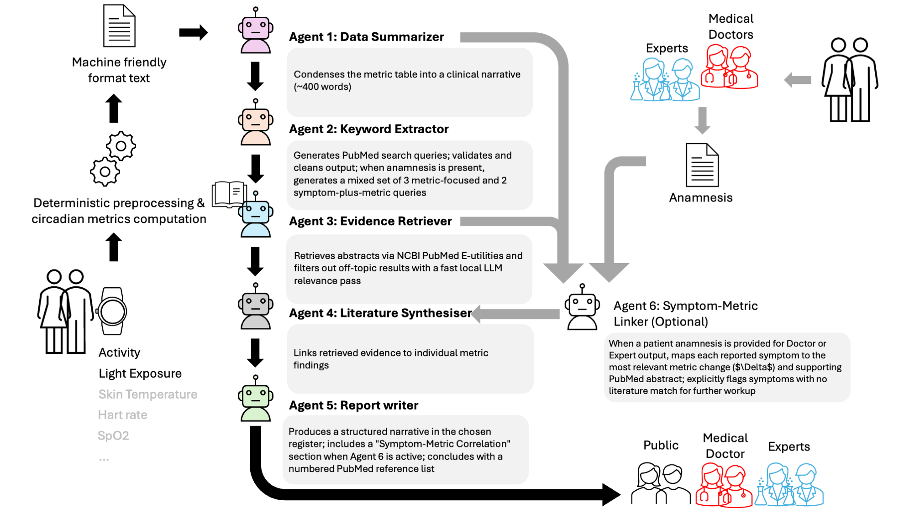

# Circadian Medicine Analysis Suite

A privacy-preserving, AI-augmented web application for clinical circadian rhythm and sleep-wake analysis from wearable actigraphy data.

---

## Overview

**Circadian Medicine Analysis Suite** is a [Streamlit](https://streamlit.io)-based research tool that provides an end-to-end workflow for:

1. Uploading and managing multi-day wrist actigraphy recordings
2. Computing a comprehensive set of validated circadian, sleep, and light-exposure metrics
3. Comparing recordings across multiple time periods (e.g., before/after intervention)
4. Generating structured clinical reports via a 5- or 6-agent AI pipeline that runs **entirely locally** — no patient data ever leaves the machine

It was developed as a personal project.

---

## Workflow



---

## Technical Documentation

Developer-oriented architecture and integration documentation is available in `docs/`:

- `docs/README.md` — index of all technical documents
- `docs/ARCHITECTURE.md` — system structure and end-to-end data flow
- `docs/PYTHON_FILE_MAP.md` — purpose/inputs/outputs for all Python files
- `docs/TOOLS_AND_SERVICES_API.md` — orchestration interface contracts
- `docs/AGENT_PIPELINE.md` — multi-agent pipeline behavior and routing
- `docs/EXTENSIBILITY_GUIDE.md` — exact integration path for new modalities (for example, skin temperature)
- `docs/DATABASE_SCHEMA.md` — persistence model and artifact ownership

---

## Features

### Actigraphy Metrics

| Domain | Metric | Description |
|--------|--------|-------------|
| **Activity** | IS / IV | Interdaily Stability & Intradaily Variability (rolling 2-day) |
| **Activity** | L5 / M10 / RA | Least-active 5 h, Most-active 10 h, Relative Amplitude |
| **Activity** | Cosinor | Daily mesor, amplitude, acrophase fitted by nonlinear least-squares |
| **Activity** | CPD | Change Point Detection on activity pattern |
| **Sleep** | Sleep Periods | Onset time, offset time, mid-sleep time per night |
| **Sleep** | SRI | Sleep Regularity Index (rolling sliding window) |
| **Sleep** | Sleep–Light Exposure | Light-level classification during sleep/wake transition windows |
| **Sleep** | CPD | Circular change-point detection on mid-sleep phase |
| **Light** | IS / IV | Interdaily Stability & Intradaily Variability of light exposure |
| **Light** | L5 / M10 / RA | Darkest 5 h, brightest 10 h, Relative Amplitude of light |
| **Light** | Cosinor | Daily mesor, amplitude, acrophase of melanopic EDI |
| **Light** | CPD | Change Point Detection on light exposure pattern |

### AI Analysis Pipeline (fully local)

A 5-agent [LangGraph](https://github.com/langchain-ai/langgraph) pipeline processes the computed metrics:

```
JSON report
    ↓
Agent 1 – Data Summariser        (Ollama LLM)
    ↓
Agent 2 – Keyword Extractor      (Ollama LLM)
              → 3–5 MeSH-style PubMed queries
              → query validated & cleaned (strips artefacts, enforces 2–8 word phrases)
              → if anamnesis present: mixed metric + symptom+metric combo queries
    ↓
Agent 3 – Literature Search      (PubMed E-utilities API — only queries sent)
              → abstracts filtered for relevance by a fast local LLM
    ↓
Agent 4 – Literature Synthesiser (Ollama LLM)
    ↓
Agent 6 – Symptom-Metric Linker  (Ollama LLM) ← only runs when anamnesis provided
              → structured table: symptom → metric Δ → PMID
              → flags unexplained symptoms for further clinical workup
    ↓
Agent 5 – Report Writer          (Ollama LLM, audience-aware)
              → Symptom-Metric Correlation section (when anamnesis present)
              → numbered PubMed reference list (PMID + URL) appended
    ↓
Structured clinical report (expert / doctor / layperson)
```

**Privacy guarantee:** only keyword search queries reach the internet. All raw metrics, identifiers, patient data, and anamnesis remain on the local machine.

### Other Features

- **Multi-period comparison** — side-by-side metric tables with Δ values
- **Anamnesis integration** — Doctor/Expert reports accept a free-text patient anamnesis; symptoms are mapped to metric changes by Agent 6 and persisted per record in the database
- **User authentication** — PBKDF2-HMAC-SHA256 hashed passwords
- **Persistent SQLite storage** — all analyses stored locally in `Actigraph_record.db`
- **JSON report export** — structured reports for downstream analysis
- **AI analysis snapshots** — every LLM report saved to `ai_analyses/` with metadata

---

## Requirements

- Python ≥ 3.10
- [Ollama](https://ollama.com) installed and running locally with at least one model (e.g., `phi4:14b`, `qwen2.5:7b`)
- macOS / Linux (Windows support untested)

---

## Installation

```bash
# 1. Clone the repository
git clone https://github.com/arahjou/APP_CIRCADIAN_MEDICINE.git
cd APP_CIRCADIAN_MEDICINE

# 2. Create and activate a virtual environment
python -m venv .venv
source .venv/bin/activate        # macOS / Linux
# .venv\Scripts\activate.bat     # Windows

# 3. Install dependencies
pip install -r requirements.txt

# 4. Pull an Ollama model (choose one — larger models give richer reports)
ollama pull phi4:14b             # recommended
# ollama pull qwen2.5:7b         # lighter alternative

# 5. Launch the app
streamlit run app.py
```

Open your browser at `http://localhost:8501`.

> **Production security update:** credentials are now DB-backed. Bootstrap an admin with:
> ```bash
> python scripts/bootstrap_admin.py --username admin --password '<strong-password>'
> ```

---

## Testing

Run the local test suite:

```bash
pytest -q tests
```

Run static checks used in CI:

```bash
ruff check app.py tools services scripts tests
mypy tools/settings.py tools/pubmed_search.py services tests/unit tests/integration
```

The GitHub Actions workflow in `.github/workflows/ci.yml` runs these checks automatically on push and pull request.

---

## Input Data Format

The application expects one or more CSV files with the following columns:

| Column | Required | Description |
|--------|----------|-------------|
| `DATE/TIME` | ✓ | Timestamp: `MM/DD/YYYY HH:MM:SS` |
| `PIMn` | ✓ | Proportional Integrating Measure (activity count) |
| `MELANOPIC EDI` | ✓ | Melanopic Equivalent Daylight Illuminance (lux) |
| `WHITE LIGHT (LUX)` | ✓ | Photopic illuminance (lux) |
| `SLEEP/WAKE` | ✓ | Binary sleep state (0 = wake, 1 = sleep) |

Sample data files are provided in the `data/` directory.

---

## Usage Workflow

1. **New Analysis** tab — Upload a CSV file, enter a participant ID and description, select a date range, and run the full metric battery.
2. **Previous Analyses** tab — Browse, review, and export stored analyses.
3. **Compare Records** tab — Select two or more record IDs to generate a side-by-side comparison report (JSON).
4. **AI Analysis** tab — Select two record IDs, choose a target audience (expert / doctor / layperson) and Ollama model, then run the pipeline to generate a literature-grounded clinical report. For Doctor and Expert audiences, optionally enter a patient anamnesis — this activates Agent 6, which maps each reported symptom to the most relevant metric change and supporting PubMed evidence, and flags symptoms with no literature match.

---

## Production Configuration (MVP)

Configure via environment variables:

```bash
export APP_ENV=prod
export DB_PATH=Actigraph_record.db
export NCBI_API_KEY=...
export ALLOWED_MODELS=phi4:14b,llama3.2,qwen3.5:9b
export SESSION_TIMEOUT_MINUTES=30
export MAX_LOGIN_ATTEMPTS=5
export LOGIN_WINDOW_MINUTES=15
export LOCKOUT_MINUTES=15
export SHOW_RAW_PIPELINE_TRACES=0
```

### Credentials and API Keys

- Real secrets must be stored in a local `.env` file (gitignored) or shell environment variables, not in tracked files.
- `NCBI_API_KEY` is optional but recommended for higher PubMed throughput.
  - Request it from your NCBI account settings: `https://account.ncbi.nlm.nih.gov/settings/`
- `DB_BACKUP_KEY` is required for encrypted backups.
  - Generate a strong key locally, for example:
    ```bash
    openssl rand -hex 32
    ```
- If any credential was previously exposed, rotate/revoke it at the provider before reuse.

Backup and integrity check (encrypted):

```bash
export DB_BACKUP_KEY='<long-random-secret>'
python scripts/backup_db.py --db Actigraph_record.db --out-dir backups
```

Run retrieval benchmark:

```bash
python scripts/evaluate_pubmed_retrieval.py
```

---

## Release Checklist

1. Run `pytest -q tests` and `python stress_test.py`
2. Run `python scripts/evaluate_pubmed_retrieval.py` and review `precision@5`
3. Verify `python scripts/backup_db.py ...` succeeds
4. Validate DB migration on a copy of production DB
5. Tag release and keep rollback artifact (previous tagged commit + DB backup)

---

## Project Structure

```
app.py                  # Main Streamlit application
requirements.txt        # Python dependencies
tools/
    upload_file.py          # File ingestion and date filtering
    database.py             # SQLite ORM (ActigraphDB)
    # Sleep
    sleep_on_off_mid.py         # Sleep onset / offset / mid-sleep detection
    sleep_SRI.py                # Sleep Regularity Index
    sleep_CPD_ms.py             # Circular CPD on mid-sleep phase
    sleep_light_exposure.py     # Light-level classification at sleep/wake transitions
    # Activity
    activity_plotter.py
    activity_IS_IV.py           # Interdaily Stability & Intradaily Variability
    activity_L5_M10_RA.py       # L5, M10, Relative Amplitude
    activity_cosinor.py         # Nonlinear cosinor fitting
    activity_CPD.py             # Activity change-point detection
    # Light
    light_plotter.py
    light_IS_IV.py
    light_L5_M10_RA.py
    light_cosinor.py
    light_CPD.py
    # Reporting & AI
    report_generator.py         # JSON comparison report builder
    llm_conversation.py         # 5/6-agent LangGraph pipeline (+ anamnesis support)
    pubmed_search.py            # PubMed E-utilities wrapper (returns text + PMIDs)
data/                   # Sample actigraphy files (no patient data)
ai_analyses/            # Saved AI report snapshots
```

---

## Citation

If you use this software in your research, please cite:

```
Ali Rahjouei (2026). Circadian Medicine Analysis Suite (Version 0.1.0) [Computer software].
Charité – Universitätsmedizin Berlin. https://doi.org/10.5281/zenodo.XXXXXXX (placeholder DOI; replace after tagging and Zenodo archiving)
```

Or use `CITATION.cff` in this repository. The DOI field is currently a placeholder until the first public archived release is minted.

---

## Contributing

Contributions are welcome. See [CONTRIBUTING.md](CONTRIBUTING.md) for setup, workflow, and pull request expectations.

For questions and bug reports, see [SUPPORT.md](SUPPORT.md).

Project history is tracked in [CHANGELOG.md](CHANGELOG.md).

GitHub issue and pull request templates are provided under `.github/` to standardize reports and reviews.

---

## License

[MIT License](LICENSE) — © 2026 Ali Rahjouei, Charité – Universitätsmedizin Berlin.

---

## Acknowledgements

Developed at the Circadian Medicine Group, Charité – Universitätsmedizin Berlin.  
Actigraphy data acquired with [device name, e.g., Actiwatch / MotionWatch].  
LLM inference powered by [Ollama](https://ollama.com).  
Literature retrieval via [NCBI PubMed E-utilities](https://www.ncbi.nlm.nih.gov/books/NBK25499/).
