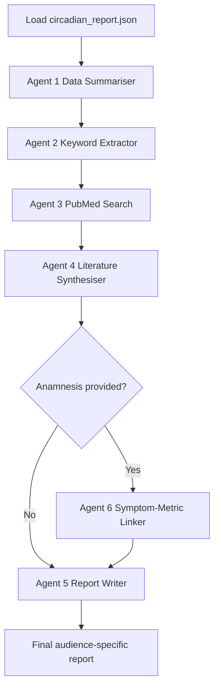

# AI Agent Pipeline

This document describes the multi-agent report pipeline used by the app, including state fields, transitions, and persistence.

Primary implementation:
- tools/llm_conversation.py (Ollama)

Alternate implementation:
- OpenAI/llm_conversation_OpenAI.py (OpenAI-compatible endpoint)

Related deep-dive:
- Agent6.md (Agent 6 specific behavior)

## 1) Pipeline Overview



ASCII view:

```text
JSON report
  -> Agent 1 summary
  -> Agent 2 structured search intents
  -> Agent 3 retrieval from PubMed
  -> Agent 4 evidence synthesis
  -> (optional Agent 6 symptom-metric mapping)
  -> Agent 5 final report for target audience
```

## 2) Pipeline State Contract

PipelineState fields in tools/llm_conversation.py:

- json_filepath: path to report JSON input
- compact_report: flattened metrics text used by Agent 1
- data_summary: Agent 1 output
- search_queries: Agent 2 output (structured query objects)
- raw_abstracts: concatenated evidence text from Agent 3
- pmid_list: PubMed IDs from Agent 3
- evidence_items: structured evidence records from Agent 3
- lit_summary: Agent 4 output
- anamnesis: optional symptom/history input from UI
- symptom_metric_table: Agent 6 output (optional)
- claim_to_pmid_map: grounding map used by final writer
- audience: layperson | doctor | expert
- final_report: Agent 5 output
- model: selected model name
- progress_callback: optional UI callback for progress updates

## 3) Agent-by-Agent Responsibilities

### Agent 1: Data Summariser
- Input:
  - compact_report
- Output:
  - data_summary
- Goal:
  - Convert metric deltas to concise clinical summary for search planning.

### Agent 2: Keyword Extractor
- Input:
  - data_summary
  - optionally anamnesis
- Output:
  - search_queries (up to 5 structured entries)
- Goal:
  - Build MeSH-friendly search intents for retrieval.

### Agent 3: Literature Search
- Input:
  - search_queries
- Dependencies:
  - tools/pubmed_search.py
- Output:
  - evidence_items
  - raw_abstracts
  - pmid_list
- Goal:
  - Retrieve and rank evidence with lexical + optional LLM filtering.

### Agent 4: Literature Synthesiser
- Input:
  - raw_abstracts
  - data_summary
- Output:
  - lit_summary
- Goal:
  - Create compact evidence synthesis for downstream report writing.

### Agent 6: Symptom-Metric Linker (conditional)
- Input:
  - anamnesis
  - data_summary
  - raw_abstracts
- Output:
  - symptom_metric_table
- Goal:
  - For each reported symptom, map most relevant metric change and supporting PMID.

### Agent 5: Report Writer
- Input:
  - data_summary
  - lit_summary
  - audience
  - optional symptom_metric_table
- Output:
  - final_report
- Goal:
  - Generate final audience-specific report with references.

## 4) Routing Logic

- After Agent 4:
  - If anamnesis is non-empty -> run Agent 6 then Agent 5.
  - Otherwise -> run Agent 5 directly.

## 5) Persistence and Traceability

- App persists whole run via tools/database.py:
  - ai_analysis_runs table
  - ai_agent_traces table
- App saves per-run snapshot files:
  - ai_analyses/<user>_<period1>_vs_<period2>_<model>_<timestamp>.txt
  - ai_analyses/<...>.meta.json

## 6) External Boundary and Privacy

- External call path:
  - Agent 3 -> tools/pubmed_search.py -> NCBI E-utilities
- Privacy behavior:
  - Only keyword queries are sent externally.
  - Raw patient metrics, IDs, and full dataframes remain local.

## 7) Failure Behavior

- get_intermediate_results returns fallback-safe output if graph invocation fails.
- Integration test exists for fallback behavior:
  - tests/integration/test_pipeline_fallback.py

Last verified against codebase state: 2026-04-04.
