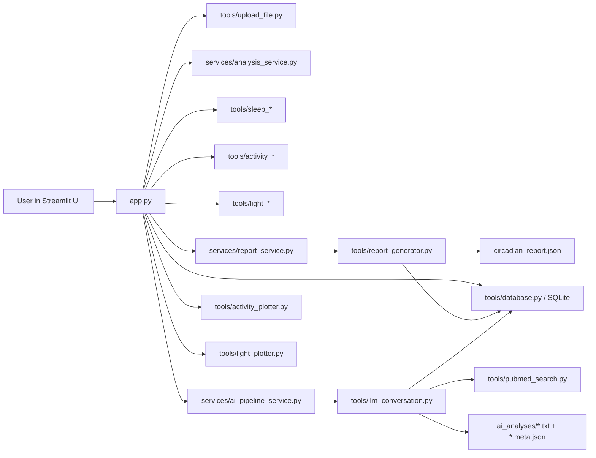
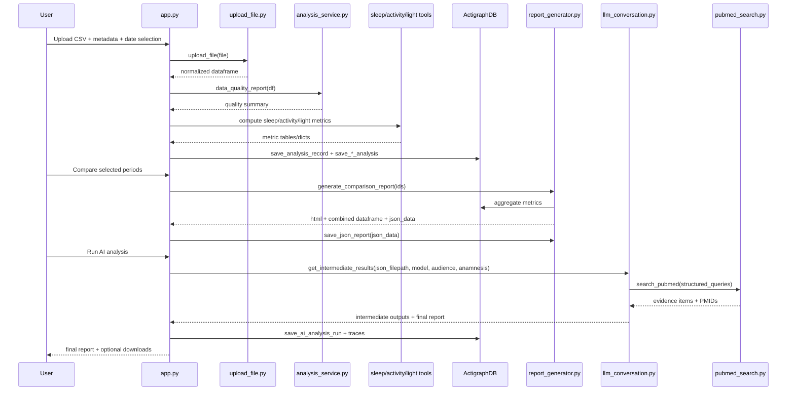

# System Architecture

This document explains structure, responsibilities, and communication across the Circadian Medicine Analysis Suite.

## 1) High-Level Topology



ASCII view:

```text
User
  |
  v
app.py (Streamlit orchestrator)
  |-- upload_file.py -> parsed dataframe
  |-- analysis_service.py -> quality checks
  |-- sleep/activity/light tools -> metric dataframes and dicts
  |-- database.py -> analysis persistence
  |-- report_service.py -> report_generator.py -> circadian_report.json
  |-- ai_pipeline_service.py -> llm_conversation.py -> pubmed_search.py
  |                                              -> ai_analyses snapshots
  '-- plotters -> figures rendered in UI
```

## 2) Layers and Responsibilities

- Presentation layer: app.py
  - Authentication, tab navigation, workflow gating, user interaction, rendering figures/tables.
- Service layer: services/*.py
  - Thin orchestration wrappers around quality checks, report assembly, and AI pipeline execution.
- Analysis tool layer: tools/*
  - Domain logic for sleep/activity/light metrics, ingestion, reporting, persistence, LLM pipeline, logging, settings.
- Persistence layer: SQLite via tools/database.py
  - Analysis records, modality metrics, AI run outputs, traces, users, audit logs.
- External boundary:
  - PubMed E-utilities through tools/pubmed_search.py.
  - Ollama models via tools/llm_conversation.py.

## 3) End-to-End Data Flow



ASCII flow:

```text
CSV -> upload_file -> data_quality_report -> sleep editor/inference
    -> date filter -> sleep/activity/light metrics
    -> save to SQLite
    -> compare IDs -> report_generator -> circadian_report.json
    -> AI pipeline (Agents 1..6) + PubMed retrieval
    -> persisted AI run + snapshots + UI output
```

## 4) Communication Contracts (Core)

- app.py -> tools/upload_file.py
  - Input: uploaded CSV file-like object.
  - Output: normalized dataframe with DATE/TIME, modality signals, DATE/TIME-derived fields.
- app.py -> services/analysis_service.py
  - Input: dataframe.
  - Output: quality summary dict with missing columns, coverage, sampling interval, timezone.
- app.py -> sleep/activity/light metric modules
  - Input: filtered dataframe and modality columns.
  - Output: per-metric dataframe/dict persisted by analysis type.
- app.py -> services/report_service.py
  - Input: list of record IDs.
  - Output: HTML report, combined metrics dataframe, JSON report structure.
- app.py -> services/ai_pipeline_service.py
  - Input: report JSON path, model, audience, anamnesis, progress callback.
  - Output: run_id and full pipeline result payload.
- app.py <-> tools/database.py
  - Input/output: record metadata, modality metric blobs, AI pipeline artifacts, auth/audit state.

## 5) Output Artifacts and Ownership

- SQLite database: Actigraph_record.db
  - Owner: tools/database.py
  - Writers: app.py, report_generator.py, llm_conversation.py integration in app.py.
- Comparison report JSON: circadian_report.json
  - Writer: tools/report_generator.py via save_json_report().
  - Reader: app.py and tools/llm_conversation.py pipeline entry.
- AI snapshots: ai_analyses/*.txt and *.meta.json
  - Writer: app.py helper _save_ai_analysis_snapshot().
  - Reader: app.py history loader for user-specific retrieval.

## 6) OpenAI Variant

- OpenAI/app_OpenAI.py and OpenAI/llm_conversation_OpenAI.py mirror the main pipeline but target an OpenAI-compatible endpoint.
- Mainline app.py uses services and the Ollama-based tools/llm_conversation.py implementation.

## 7) Known Extension Points

- New modality ingestion: upload_file.py schema extension and app.py preprocessing branch.
- New modality metrics: new tools/<modality>_*.py modules and app.py orchestration calls.
- New report dimensions: report_generator.py table/json assembly and report_service.py contract.
- New AI pipeline behavior: llm_conversation.py PipelineState, agent nodes, graph edges.

Last verified against codebase state: 2026-04-04.
