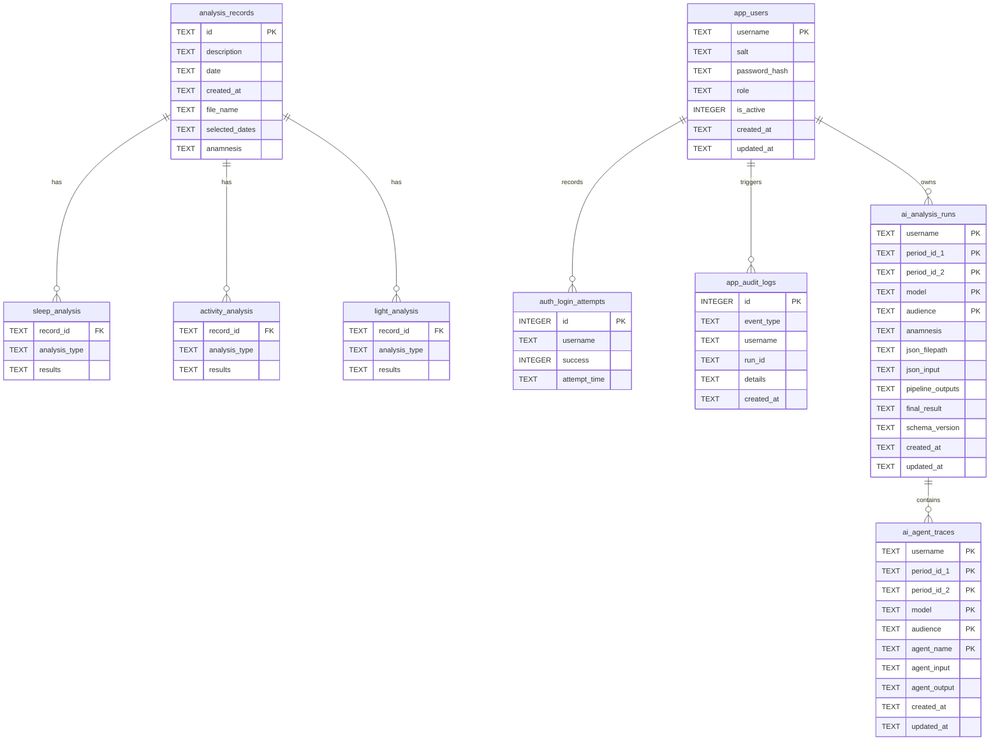

# Database Schema and Persistence

Primary database file: Actigraph_record.db (SQLite)
Primary access layer: tools/database.py (ActigraphDB)

## 1) Entity Relationship View



ASCII relationship view:

```text
analysis_records (1) -> (many) sleep_analysis/activity_analysis/light_analysis
app_users (1) -> (many) auth_login_attempts
app_users (1) -> (many) app_audit_logs
ai_analysis_runs (composite key) -> (many) ai_agent_traces
```

## 2) Table Roles

- analysis_records:
  - Master row per uploaded/processed period.
  - Stores metadata and selected_dates context.
- sleep_analysis, activity_analysis, light_analysis:
  - Metric storage by analysis_type with JSON results.
- ai_analysis_runs:
  - Cached complete AI run per user + period pair + model + audience.
- ai_agent_traces:
  - Per-agent input/output trace for audit and reproducibility.
- app_users:
  - PBKDF2 password entries and role.
- auth_login_attempts:
  - Lockout and brute-force resistance support.
- app_audit_logs:
  - Security and workflow audit events.

## 3) Write Paths

- app.py writes:
  - analysis_records
  - modality analysis tables via save_*_analysis
  - ai_analysis_runs and ai_agent_traces
  - audit entries
- tools/report_generator.py reads modality tables and writes report JSON (file).
- tools/database.py owns schema creation and migrations.

## 4) Read Paths

- app.py tab views read records and analyses.
- report generation reads aggregated metrics by selected IDs.
- AI tab optionally loads cached ai_analysis_runs by exact key.

## 5) Artifacts Outside DB

- circadian_report.json
  - Created by tools/report_generator.save_json_report.
  - Serves as AI pipeline input.
- ai_analyses/*.txt and *.meta.json
  - Snapshot outputs created by app.py for user-level history.

## 6) Modality Extension Rules

To add a new modality table:

1. Add CREATE TABLE block in ActigraphDB.init_database.
2. Add save/get/aggregate support methods.
3. Include table in allowed table list used by aggregation routines.
4. Update report generator and docs to include modality in output contracts.

Last verified against codebase state: 2026-04-04.
