# Extensibility Guide

This guide explains exactly where and how to add a new modality (example: skin temperature) end-to-end.

## 1) Integration Blueprint

```mermaid
flowchart LR
    A[New raw column in CSV] --> B[tools/upload_file.py parse + normalize]
    B --> C[app.py preprocessing + date filtering]
    C --> D[tools/<modality>_*.py metric computation]
    D --> E[tools/database.py new table + save/get methods]
    E --> F[tools/report_generator.py include in comparison JSON]
    F --> G[services/report_service.py pass-through]
    G --> H[app.py render + AI input availability]
    H --> I[tools/llm_conversation.py prompt/state updates if needed]
```



ASCII view:

```text
CSV column -> ingestion normalization -> tab1 computation block
          -> DB persistence -> comparison/report JSON -> AI summary context
          -> UI visualization and outputs
```

## 2) Example: Add Skin Temperature Modality

### Step A: Ingestion contract
- Update tools/upload_file.py:
  - Ensure temperature source column is parsed and normalized.
  - Add consistent output column name, for example SKIN_TEMP.
- Validate in services/analysis_service.py if modality should be required.

### Step B: Analysis modules
- Create new modules under tools/:
  - tools/temperature_plotter.py
  - tools/temperature_IS_IV.py
  - tools/temperature_L5_M10_RA.py
  - tools/temperature_cosinor.py
  - tools/temperature_CPD.py
- Follow activity/light signatures so orchestration stays uniform.

### Step C: App orchestration
- Update app.py:
  - Import new temperature modules.
  - Run calculations in tab1 analysis flow.
  - Save outputs using DB methods.
  - Add visualizations in analysis output section.

### Step D: Persistence
- Update tools/database.py:
  - Create table, for example temperature_analysis(record_id, analysis_type, results).
  - Add save_temperature_analysis(...) and retrieval/aggregation support.
  - Extend allowed table list for aggregation APIs.

### Step E: Comparison report and JSON
- Update tools/report_generator.py:
  - Include temperature metrics in table generation.
  - Add temperature section to JSON payload used by AI pipeline.
- services/report_service.py remains pass-through unless contract shape changes.

### Step F: AI pipeline integration
- Update tools/llm_conversation.py if needed:
  - Ensure compact report flattening includes new section fields.
  - Update prompts if domain-specific interpretation is desired.

### Step G: Tests
- Add unit tests for each new metric file.
- Add integration test verifying report generation includes temperature section.
- Add pipeline test for new metric terms appearing in AI summary context.

## 3) Mandatory File Checklist

For a new modality, verify edits across this checklist:

- tools/upload_file.py
- services/analysis_service.py (if required-column policy changes)
- app.py
- tools/<new_modality>_*.py files
- tools/database.py
- tools/report_generator.py
- docs/ARCHITECTURE.md
- docs/TOOLS_AND_SERVICES_API.md
- docs/DATABASE_SCHEMA.md
- docs/PYTHON_FILE_MAP.md
- tests/unit/* new modality tests
- tests/integration/* end-to-end coverage

## 4) Output Routing Rules

- Metric-level outputs:
  - Persist as JSON in modality analysis table.
- Comparison-level outputs:
  - Must appear in report_generator JSON under a stable section name.
- AI-level outputs:
  - Must be present in compact_report input to Agent 1 if downstream narrative should include modality.

## 5) Design Rules for New Modality Modules

- Keep signatures parallel to existing activity/light modules.
- Return stable column names for aggregation compatibility.
- Do not hardcode file paths; use settings or app context.
- Preserve timezone-aware timestamp handling from ingestion path.
- Emit clinically interpretable units in report fields where possible.

## 6) Quick Validation Workflow

1. Run one new analysis from UI and confirm DB rows written for new modality.
2. Run compare flow and confirm JSON report includes new modality section.
3. Run AI analysis and confirm summary references new modality metrics.
4. Run automated tests including new unit/integration tests.

Last verified against codebase state: 2026-04-04.
